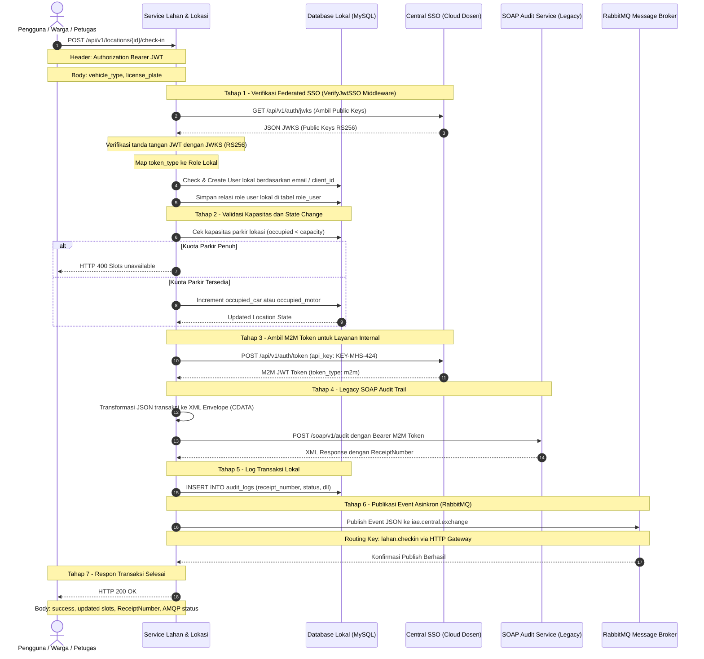

# Analisis Tugas 3 - Integrasi Sistem Terdistribusi (Layanan Lahan & Lokasi)

**Nama:** Rafly Rheinzeda  
**NIM / Account:** warga12@ktp.iae.id (TEAM-06 / KEY-MHS-424)  
**Mata Kuliah:** Integrasi Aplikasi Perusahaan (IAE)  

---

## 1. Justifikasi Transaksi Kritis (State-Changing)

Dalam ekosistem **DPark Bandung (Layanan Parkir Kendaraan)**, transaksi paling kritis yang dikelola oleh **Service Lahan & Lokasi** adalah proses **Vehicle Check-In** (`POST /api/v1/locations/{id}/check-in`).

### Mengapa Check-In Merupakan Transaksi Kritis?

1. **Perubahan State (State-Changing):** Transaksi ini secara langsung memodifikasi data kapasitas parkir riil di database (`occupied_car` atau `occupied_motor` ditambahkan). Keakuratan slot kosong sangat krusial agar pengguna tidak diarahkan ke gedung parkir yang sebenarnya sudah penuh.

2. **Ketergantungan Keamanan Terpusat (Federated SSO):** Setiap check-in harus dilakukan oleh entitas yang terverifikasi (apakah itu warga melalui aplikasi seluler — `token_type: user` — atau petugas pos parkir menggunakan token M2M — `token_type: m2m`).

3. **Akuntabilitas & Audit Trail (SOAP):** Setiap kendaraan masuk wajib didokumentasikan ke sistem audit eksternal milik dosen (Legacy SOAP/XML) guna menjamin transparansi data kendaraan dan pencegahan kecurangan (fraud) pendapatan parkir. Respon berupa `ReceiptNumber` disimpan secara lokal sebagai bukti transaksi audit yang sah.

4. **Penyebaran Event Asinkron (RabbitMQ):** Setelah check-in berhasil, service lain seperti *Layanan Transaksi* (untuk pencatatan durasi/tarif) dan *Layanan Membership* perlu diberitahu secara asinkron bahwa kendaraan dengan plat nomor tertentu telah masuk ke area parkir.

---

## 2. Sequence Diagram Interaksi Sistem

Berikut adalah aliran proses lengkap saat pengguna melakukan check-in kendaraan pada Service Lahan & Lokasi:

---

## 3. Skema Database & Role Lokal

Sistem memetakan user SSO terpusat ke role lokal sebagai berikut:

| Token Type | Domain | Role Lokal |
|-----------|--------|------------|
| `user` | `@ktp.iae.id` | `warga` |
| `m2m` | API Key `KEY-MHS-XXX` | `admin` |

Tabel lokal yang dibuat untuk mendukung fitur ini:

- **`roles`** — Menyimpan daftar role lokal (`warga`, `petugas`, `admin`)
- **`role_user`** — Pivot table relasi many-to-many antara user dan role
- **`audit_logs`** — Menyimpan history transaksi check-in lengkap beserta `receipt_number` dari server SOAP audit eksternal

---

## 4. Bukti Keberhasilan Teknis

| Komponen | Status | Bukti |
|----------|--------|-------|
| **Modul 1: Federated SSO** | ✅ Berhasil | User `warga12@ktp.iae.id` → role `warga`; M2M `KEY-MHS-424` → role `admin` |
| **Modul 2: SOAP XML Client** | ✅ Berhasil | `ReceiptNumber: IAE-LOG-2026-1511B2E8` tersimpan di DB |
| **Modul 3: AMQP Publisher** | ✅ Berhasil | `published: True, method: http` via `iae.central.exchange` |
| **Modul 4: Prompt Log** | ✅ Ada | Lihat file `log_promt.md` di repository |
