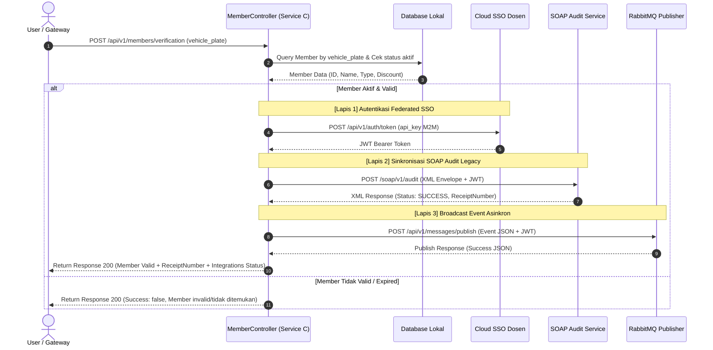

# Dokumen Analisis Tugas 3 - Integrasi Aplikasi Enterprise

**Nama:** Ekky Novriza Alam  
**Kelas:** BBK2HAB3 - Integrasi Aplikasi Enterprise  
**Program Studi:** S1 Sistem Informasi  

---

## 1. Justifikasi Transaksi Kritis (State-Changing)

Dalam **DPark Membership Service (Service C)**, transaksi yang diidentifikasi sebagai transaksi kritis adalah **Verifikasi Membership (`verifyMembership`)** yang dipicu saat kendaraan hendak melakukan transaksi parkir.

### Mengapa Transaksi Ini Dinilai Kritis?
1. **Dampak Finansial Langsung (State-Changing Decision)**: Verifikasi membership menentukan apakah seorang pengguna berhak mendapatkan diskon tarif parkir (10% untuk reguler, 20% untuk premium, dan 30% untuk VIP). Kesalahan dalam penentuan status membership akan menyebabkan kesalahan perhitungan keuangan pada gate pembayaran (Service B).
2. **Kebutuhan Audit Kepatuhan (SOAP Audit)**: Setiap verifikasi yang berhasil harus dicatat secara kaku pada sistem audit pusat (Legacy SOAP) untuk memastikan bahwa diskon yang diberikan benar-benar sah, mencegah fraud (manipulasi status member), dan memiliki nomor bukti audit (`ReceiptNumber`) resmi dari Cloud Dosen.
3. **Penyebaran Data Real-Time (RabbitMQ Event)**: Aktivitas verifikasi membership harus disebarkan ke departemen lain (seperti analitik traffic dan manajemen gate parkir) secara asinkron agar tidak memblokir antrean fisik kendaraan di pintu masuk/keluar parkir.

---

## 2. Sequence Diagram Interaksi Layanan dengan Sistem Terpusat (SSO, SOAP, RabbitMQ)

Berikut adalah diagram urutan alur data internal saat request verifikasi membership masuk ke **Service C (Membership Service)**:

---

## 3. Desain SSO Mapping ke Database Lokal

Sistem keamanan menggunakan **Federated SSO** berbasis JWT (RS256). Ketika pengguna (misal: Warga/Dosen) melakukan login:
1. JWT didekode menggunakan Public Key (JWKS) dari endpoint SSO Dosen.
2. Field `sub` (SSO User ID), `email`, dan `roles` diekstrak dari payload JWT.
3. User dipetakan ke tabel lokal `local_roles` dengan aturan pemetaan:
   - Jika role SSO berisi `'admin'` atau `'dosen'` $\rightarrow$ Dipetakan sebagai `'admin'` di DPark.
   - Jika role SSO berisi `'operator'` $\rightarrow$ Dipetakan sebagai `'operator'` di DPark.
   - Selain itu $\rightarrow$ Dipetakan sebagai `'member'` (default).

Tabel skema lokal `local_roles`:
- `sso_sub`: string (unique)
- `email`: string
- `local_role`: enum ('admin', 'operator', 'member')
- `jwt_payload`: text
- `last_seen`: timestamp
